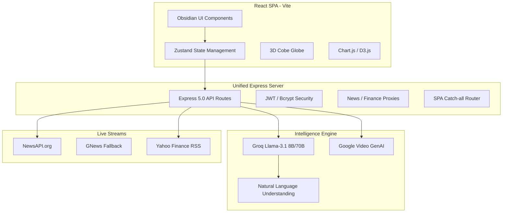
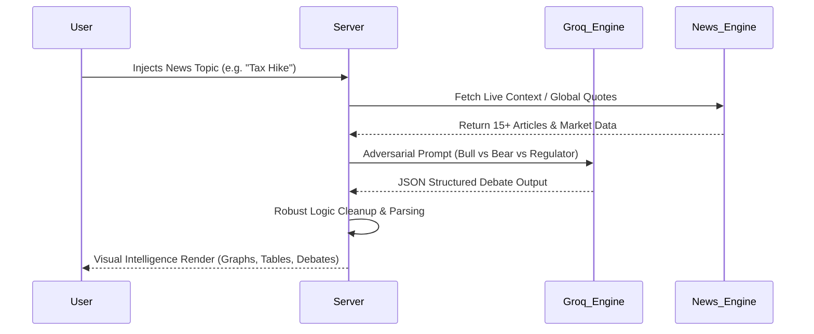

# 🌑 NewsOS: The Intelligence Operating System

> **High-Fidelity Global Intelligence. Powered by Llama-3 & Google GenAI.**

NewsOS is a futuristic, high-performance news intelligence platform designed for the modern decision-maker. It transforms the chaotic noise of the global news cycle into a structured, predictive, and cinematic intelligence experience. Built with an **Obsidian & Neon** aesthetic, it provides a "Pilot’s Command Center" view of the world.

---

## 🏗️ System Architecture

NewsOS is built on a unified Full-Stack architecture, merging a high-performance React SPA with a robust Express 5.0 backend engine.



---

## 💎 Core Modules & Deep Feature Set

### 1. 📂 Intelligence Studio (Dashboard)
The primary command center for the "Intelligence Pilot."
- **HUD Telemetry:** Real-time widgets tracking "Intel Intensity" and "Flow Velocity."
- **Nifty Mood Signal:** An AI-driven market sentiment gauge that distills thousands of business headlines into a single "Market Pulse."
- **Dynamic Feed:** A prioritized stream of mission-critical news, filtered for impact.

### 2. 🌐 News World (3D Global View)
A spatial visualization of the planet's news nodes.
- **Interactive 3D Globe:** Built with `cobe` and `react-three-fiber`, visualizing news breaking in real-time geographic locations.
- **Spatiotemporal Sync:** The news feed automatically scrolls and focuses as the globe rotates to different regions.

### 3. ⚔️ Shadow Board (Adversarial AI Debate)
The truth is found between extremes.
- **High-Level Personas:** Every major story is debated by "The Bull," "The Bear," and "The Regulator."
- **Synthesis Verdict:** The AI analyzes the debate to provide a "Neutral Reality" summary and a confidence score.
- **Cognitive Diversity:** Prevents echo chambers by forcing adversarial viewpoints on every topic.

### 4. 🔮 Fiscal Time Machine (Impact Simulation)
A predictive engine for financial consequence.
- **Headline Injection:** Users enter a specific news event (e.g., "RBI raises rates by 50bps").
- **Portfolio Projection:** Simulates the Rupee (₹) gain/loss on a user's specific portfolio size.
- **Sector Mapping:** Visualizes exactly which industry sectors (IT, Pharma, Real Estate) will be hit hardest.

### 5. 🦋 Causal Mapper (Butterfly Effect Architecture)
Tracing the invisible threads of global events.
- **Ripple Mapping:** Maps 1st, 2nd, and 3rd-order consequences of a single news event.
- **Swarm Intelligence:** Predicts long-term shifts (e.g., "A tech deal in Bengaluru leads to housing spikes in tier-2 cities").
- **Sentiment Arc:** Visualizes the predicted sentiment trajectory over an 8-week period.

### 6. 🎬 Video Studio (Cinematic Generator)
Intelligence should be seen, not just read.
- **Automated Directing:** Turns dry articles into cinematic 4K video briefings using Google's video generation models.
- **Visual Synthesis:** Automatically selects visuals, soundtracks, and narrations to match the intensity of the news.

### 7. 🗣️ Vernacular (Cultural Intelligence)
Intelligence that thinks in your language.
- **Cultural Adaptation:** Not just translation—re-writes news using local Indian analogies (e.g., comparing inflation to Mandi prices).
- **Multi-Lingual Support:** High-fidelity adaptation for Hindi, Tamil, Telugu, and Bengali audiences.

---

## 🛠️ Technology Stack

| Layer | Technology |
| :--- | :--- |
| **Frontend** | React 19, TypeScript, Vite, Tailwind CSS |
| **Animation** | Framer Motion, GSAP |
| **State** | Zustand, React Query |
| **3D / Visualization** | Cobe, Three.js, Chart.js, D3.js |
| **Backend** | Node.js, Express 5.0, TSX (Production) |
| **AI (LLM)** | Groq (Llama-3.1 8B / 70B), Google Gemini 2.0 |
| **AI (Video)** | Google Veo (Experimental), Cinematic Fallbacks |
| **Database** | PostgreSQL (Production), MemoryDB (Demo) |

---

## 🔄 AI Logic Flow



---

## 🚀 Getting Started

### Prerequisites
- Node.js 20+
- Groq Cloud API Key
- NewsAPI Key
- Google Cloud API Key (for Video/Veo)

### Installation
1. Clone the repository:
   ```bash
   git clone https://github.com/omkarpraval/newsos.git
   cd newsos
   ```
2. Install dependencies:
   ```bash
   npm install
   ```
3. Configure `.env` file:
   ```env
   GROQ_API_KEY=your_key
   NEWSAPI_KEY=your_key
   GOOGLE_API_KEY=your_key
   JWT_SECRET=your_secret
   PORT=3001
   ```
4. Run Development:
   ```bash
   npm run dev
   ```

---

## 📜 Dev Manifest
- **Obsidian Philosophy:** All UI must be high-contrast, premium, and zero-clutter.
- **Intelligence First:** Every feature must provide an "Edge" that a standard news app cannot.
- **Low Latency:** AI responses are prioritized through Groq 8B for sub-300ms inference.

---

© 2026 **NewsOS** | Intelligence for the New World.
